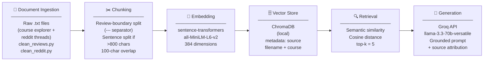

# Project 1 Planning: The Unofficial Guide

> Write this document before you write any pipeline code.
> Your spec and architecture diagram are what you'll use to direct AI tools (Claude, Copilot, etc.) to generate your implementation — the more specific they are, the more useful the generated code will be.
> Update the Retrieval Approach and Chunking Strategy sections if you change your approach during implementation.
> Update this file before starting any stretch features.

---

## Domain

<!-- What domain did you choose? Why is this knowledge valuable and hard to find through official channels? -->
Oregon State University has an eCampus BS in Computer Science program. The program has several asynchronous, online students who review the courses in a variety of websites such as reddit (subreddit r/OSUOnlineCS) and it's own bespoke website https://osu-cs-course-explorer.com/. The reviews are scattered throughout these sources and are not available on Oregon State's ecampus website.
---

## Documents

<!-- List your specific sources: URLs, subreddit names, forum threads, or file descriptions.
     Aim for at least 10 sources that together cover different subtopics or perspectives within your domain. -->

| # | Source | Description | URL or location |
|---|--------|-------------|-----------------|
| 1 | OSU CS Course Explorer| Student reviews for CS 161, 162, 225, 261, 271, 290, 325, 340, 344, 372, 493 — copied manually from SPA| Website with aggregated reviews | https://osu-cs-course-explorer.com
| 2 | r/OSUOnlineCS | Reddit thread: CS 162 vent thread | https://www.reddit.com/r/OSUOnlineCS/comments/59qykl/162_vent/ |
| 3 | r/OSUOnlineCS | Reddit thread: CS 225 anonymous rant/PSA | https://www.reddit.com/r/OSUOnlineCS/comments/19eytrd/rip_225_bro_psa_if_you_want_to_rant_anonymously/ |
| 4 | r/OSUOnlineCS | Reddit thread: CS 261 prep recommendations | https://www.reddit.com/r/OSUOnlineCS/comments/185hy2y/261_prep_recommendations/ |
| 5 | r/OSUOnlineCS | Reddit thread: CS 290 feeling lost and overwhelmed | https://www.reddit.com/r/OSUOnlineCS/comments/4i65as/cs_290_anyone_else_feeling_lost_and_overwhelmed/ |
| 6 | r/OSUOnlineCS | Reddit thread: CS 325 just want to pass | https://www.reddit.com/r/OSUOnlineCS/comments/kyu17s/325_just_want_to_pass/ |
| 7 | r/OSUOnlineCS | Reddit thread: CS 340 dark horse candidate for worst course | https://www.reddit.com/r/OSUOnlineCS/comments/oso0c1/cs340_dark_horse_candidate_for_worst_course/ |
| 8 | r/OSUOnlineCS | Reddit thread: CS 344 tips and experiences | https://www.reddit.com/r/OSUOnlineCS/comments/kgfgpa/for_those_of_us_about_to_take_cs344/ |
| 9 | r/OSUOnlineCS | Reddit thread: CS 372 revamp discussion | https://www.reddit.com/r/OSUOnlineCS/comments/185hy2y/did_they_revamp_cs_372/ |
| 10 | r/OSUOnlineCS | Reddit thread: CS 492 tougher than expected | https://www.reddit.com/r/OSUOnlineCS/comments/t5auuy/anyone_else_have_a_tougher_time_with_492_than/ |
| 11 | r/OSUOnlineCS | Reddit thread: CS 493 new reviews | https://www.reddit.com/r/OSUOnlineCS/comments/1pvvlsg/any_new_reviews_for_493/ |

---

## Chunking Strategy

<!-- How will you split documents into chunks?
     State your chunk size (in tokens or characters), overlap size, and explain why those
     numbers fit the structure of your documents.
     A review-heavy corpus warrants different chunking than a long FAQ. -->

**Max chunk size (split threshold):**
800 characters — reviews up to 800 chars are kept whole; anything longer triggers sentence-boundary splitting
**Sliding-window fallback size:**
500 characters — used only when a single sentence exceeds 800 chars
**Overlap:**
100 characters
**Reasoning:**
Most reviews average ~500 characters so they fit in one chunk. The 800-char threshold avoids splitting reviews that run slightly longer. The 500-char sliding window with 100-char overlap is a last-resort fallback for unusually long single sentences.
---

## Retrieval Approach

<!-- Which embedding model are you using (e.g., all-MiniLM-L6-v2 via sentence-transformers)?
     How many chunks will you retrieve per query (top-k)?
     If you were deploying this for real users and cost wasn't a constraint, what tradeoffs
     would you weigh in choosing a different embedding model — context length, multilingual
     support, accuracy on domain-specific text, latency? -->

**Embedding model:**
all-MiniLM-L6-v2 via sentence-transformers

**Top-k:**
5

**Production tradeoff reflection:**
The free tier of groq for llama-3.3-70b is a good fit for this project as it performs well for synthesis tasks like summarizing student reviews. Groq's rate limits would, however, be a bottleneck in a production scenario which might require a paid plan or queueing strategy.
---

## Evaluation Plan

<!-- List your 5 test questions with their expected correct answers.
     Questions should be specific enough that you can judge whether the system's response
     is right or wrong. "What are good dining halls?" is too vague.
     "What do students say about wait times at [dining hall name] during lunch?" is testable. -->

| # | Question | Expected answer |
|---|----------|-----------------|
| 1 | What do students say about the AVL tree assignment in CS 261? | Should mention it's the hardest assignment in the course, pseudocode is intentionally incorrect/incomplete, BST implementation affects AVL compatibility, most time-consuming part of the class |
| 2 | How difficult is CS 325 and what do students recommend to get through it? | Should mention heavy math/proofs, poorly organized lectures, recommends Abdul Bari on YouTube or MIT OpenCourseWare as supplements, grind homework and extra credit to offset bad exam scores |
| 3 | Is CS 344 a good course and how much time should I expect to spend on it? | Should mention 20+ hours per week, requires C programming, test on os1 not local machine, one of the hardest required courses but well-designed compared to others |
| 4 | What are students' complaints about CS 340? | Should mention vague project requirements scattered across Ed Discussion posts, too much peer review busywork, choosing the right partner matters a lot, admin-facing vs client-facing confusion |
| 5 | Which courses do students say pair well together and which combos should I avoid? | Should mention 162+271 as a heavy combo to avoid, 162+225 also mentioned as rough, 271 alone for summer is manageable, 162 pairs better with an easy course |

---

## Anticipated Challenges

<!-- What could go wrong? Name at least two specific risks with reasoning.
     Consider: noisy or inconsistent documents, missing source attribution, off-topic
     retrieval, chunks that split key information across boundaries. -->

1. There was a change in programming language from C/C++ to Python in some of the courses which caused students to be frustrated which might give irrelevant opinions (ie, subject versus tooling problems)

2. Some reviews have character count greater than ~1000 which exceeds MiniLM's 256-token limit which will lead to anything exceeding ~1000 might get cut off at embedding stage

---

## Architecture

<!-- Draw a diagram of your pipeline showing the five stages:
     Document Ingestion → Chunking → Embedding + Vector Store → Retrieval → Generation
     Label each stage with the tool or library you're using.
     You can use ASCII art, a Mermaid diagram, or embed a sketch as an image.
     You'll use this diagram as context when prompting AI tools to implement each stage. -->

## Architecture

---

## AI Tool Plan

<!-- For each part of the pipeline below, describe:
     - Which AI tool you plan to use (Claude, Copilot, ChatGPT, etc.)
     - What you'll give it as input (which sections of this planning.md, which requirements)
     - What you expect it to produce
     - How you'll verify the output matches your spec

     "I'll use AI to help me code" is not a plan.
     "I'll give Claude my Chunking Strategy section and ask it to implement chunk_text()
     with my specified chunk size and overlap" is a plan. -->

**Milestone 3 — Ingestion and chunking:**
### Document Ingestion
- **Tool:** Claude (claude.ai)
- **Input:** Documents section of planning.md (file list, two file types: `*_reviews.txt` and `*_redditthreads.txt`), the existing `clean_reviews.py` and `clean_reddit.py` scripts, Architecture diagram
- **Expected output:** `ingest.py` that loads all `.txt` files from the `documents/` folder, runs the appropriate cleaner based on filename suffix, and returns a list of `{"text": ..., "source": ..., "course": ...}` dicts ready for chunking
- **Verification:** Print the first 5 loaded documents and confirm source metadata is attached correctly to each; confirm no HTML artifacts or usernames remain

### Chunking
- **Tool:** Claude (claude.ai)
- **Input:** Chunking Strategy section of planning.md (review-boundary split on `---`, paragraph split for Reddit files, sentence-boundary fallback for chunks >800 chars, 100-char overlap), Architecture diagram, sample output from Stage 1
- **Expected output:** `chunk_text()` function in `ingest.py` that splits review files on `---` separators and Reddit files on blank lines, then applies sentence-boundary splitting with overlap for any chunk exceeding 800 chars
- **Verification:** Print 10 random chunks across 3 different course files; confirm each is self-contained, between 50–800 chars, and has correct source/course metadata; confirm total chunk count is between 1,500–2,000

**Milestone 4 — Embedding and retrieval:**
### Embedding
- **Tool:** Claude (claude.ai)
- **Input:** Retrieval Approach section of planning.md (all-MiniLM-L6-v2, ChromaDB, metadata fields: source filename + course), Architecture diagram, chunk output from Stage 2
- **Expected output:** `embed.py` that loads chunks from `ingest.py`, embeds them with `SentenceTransformer("all-MiniLM-L6-v2")`, and stores them in a local ChromaDB collection with `source` and `course` metadata fields
- **Verification:** Query ChromaDB directly for a known phrase (e.g. "AVL tree") and confirm returned chunks contain that content and have correct metadata attached
### Retrieval
- **Tool:** Claude (claude.ai)
- **Input:** Retrieval Approach section (top-k=5, cosine similarity), Architecture diagram, `embed.py` from Stage 3
- **Expected output:** `retrieve(query: str) -> list[dict]` function in `query.py` that takes a plain-language query, embeds it, queries ChromaDB for top-5 chunks, and returns each chunk with its text, source filename, course, and distance score
- **Verification:** Run all 5 evaluation plan questions through retrieval only (no LLM); print returned chunks and distance scores; confirm top results are visibly relevant and distance scores are below 0.5
- 
**Milestone 5 — Generation and interface:**
- **Tool:** Claude (claude.ai)
- **Input:** Grounding requirement (answer only from retrieved context, refuse if insufficient), output format (answer + source list), Gradio skeleton from project instructions, `retrieve()` function from Stage 4, evaluation plan questions
- **Expected output:** `ask(query: str) -> {"answer": str, "sources": list[str]}` function in `query.py` wired to Groq `llama-3.3-70b-versatile`, plus `app.py` with a Gradio UI showing answer and source fields
- **Verification:** Run all 5 evaluation plan questions end-to-end; confirm each response cites at least one source filename; ask one out-of-scope question (e.g. "What is the CS 499 capstone like?") and confirm the system says it doesn't have enough information rather than generating a plausible-sounding answer